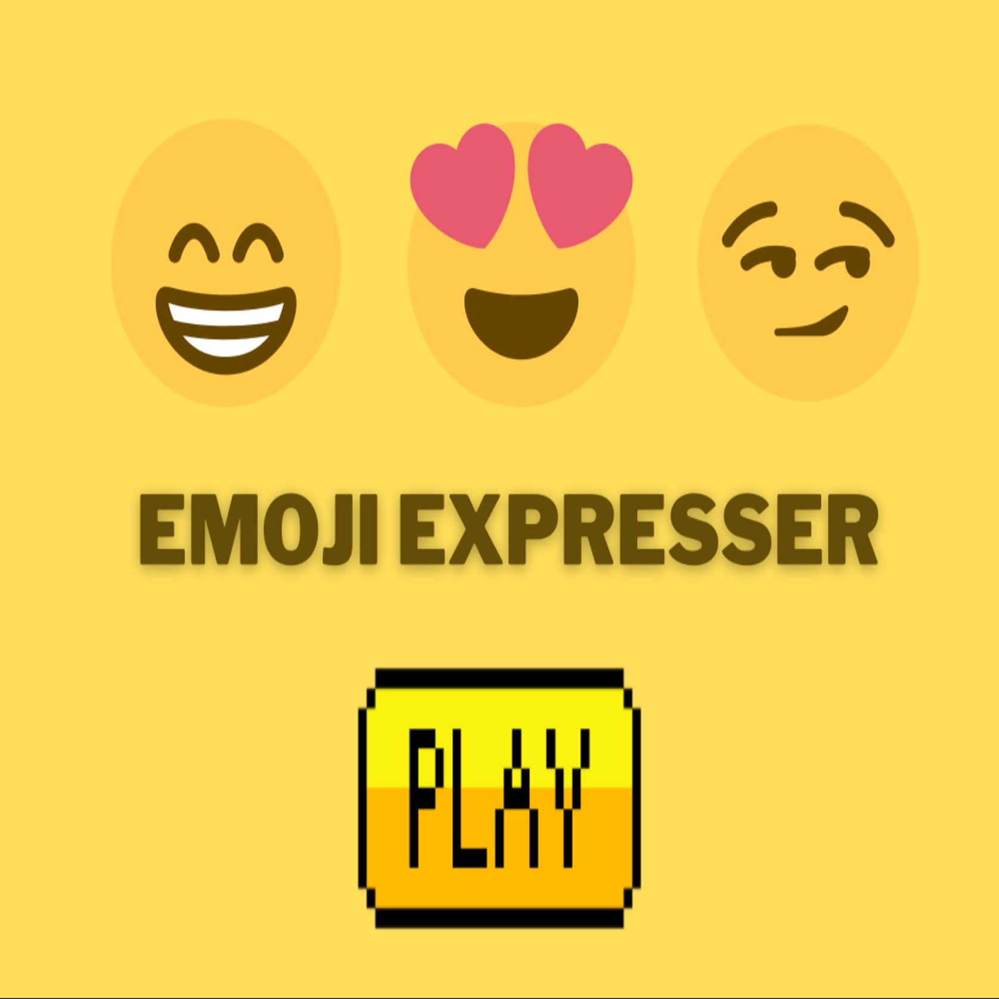
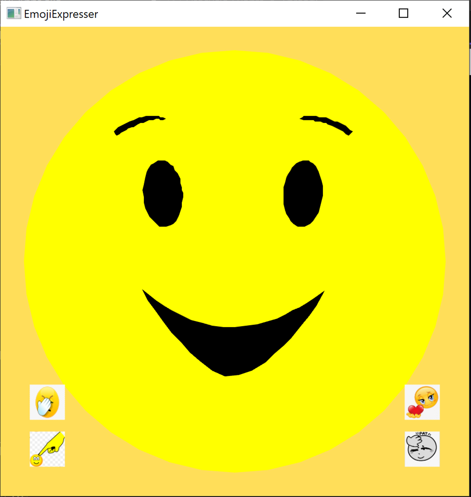

# Emoji Expresser (Apr. 2022 - Jun. 2022)

Emoji Expresser is a game that allows players to interact with an emoji to express different emotions. Developed using OpenGL, Emoji Expresser is an expressive game that allows players to perform actions and see the emotions reflected on an Emoji. Players are indulged in an expressive experience involving dynamic visuals and funny sound effects.

## Demo

<video width="80%" height="50%" controls>
  <source src="EmojiExpresserFinalOutput.mp4" type="video/mp4">
  Your browser does not support the video tag.
</video>

<h3 align="center"> Main Menu </h3>

<h3 align="center"> Main Menu </h3>

## Introduction
The players are introduced to the game with a start screen which includes some sample emojis in the background and an announcer introducing the game. Players can press the play button to be taken to another screen, including the expressive emoji and four options. The game guides players in playing the game by offering colored buttons for valid actions and greyed-out options for invalid actions. Upon pressing actions, players can see emotional expressions done to the emoji and the actions used to express it.

## Development
The project was developed with the aim of creating animated emojis. The initial sketches were hand-drawn, and the game was developed using OpenGL. The development process involved creating the basic emoji face, understanding the algorithm to create a circle, and creating an emoji face as a circle with a yellow color. The developers realized that the Emoji expression would look more expressive if the transition of the emojis could be shown on the same face. The developers made artistic decisions on what emojis to show in the game and initially decided to have a smile, sarcastic, and Valentine emojis. The transitions were implemented using interpolation and triangulation, and the buttons were added for a better user experience. The game was further improved by adding an angry emoji and including transitions for the emoji. In the end, the game had the following transitions for actions:

- Smiley [Poke] → Sarcastic
- Smiley [Love] → Valentine
- Valentine [Poke] → Sarcastic
- Valentine [Slap] → Angry
- Smiley [Slap] → Angry
- Sarcastic [Pat] → Smiley
- Sarcastic [Love] → Valentine
- Angry [Love] → Valentine
- Angry [Pat] → Smiley
- Sarcastic [Slap] → Angry

## User Experience
The fun aspect of the project initially was animating the emojis from one face to another face. The developers added sound effects to make the project cool and funny. During the presentation, almost everyone was laughing at the expressions of the game. The students were interested in trying the game, especially trying to slap the emoji and immediately patting it to make it feel better. The developers believe that the overall experience was different, especially with sound effects.

## Success and Creativity
The developers feel that the project was successful as they were able to make Emoji Expressor similar to what was initially planned. The game has a start screen and a game screen, and the game screen underwent some changes from the original design. The developers believe that the project was complete and creative, with the added sound effects bringing a different flavor to the fun of the game. The user interface is good, with colored buttons for valid actions and greyed-out options for invalid actions.
